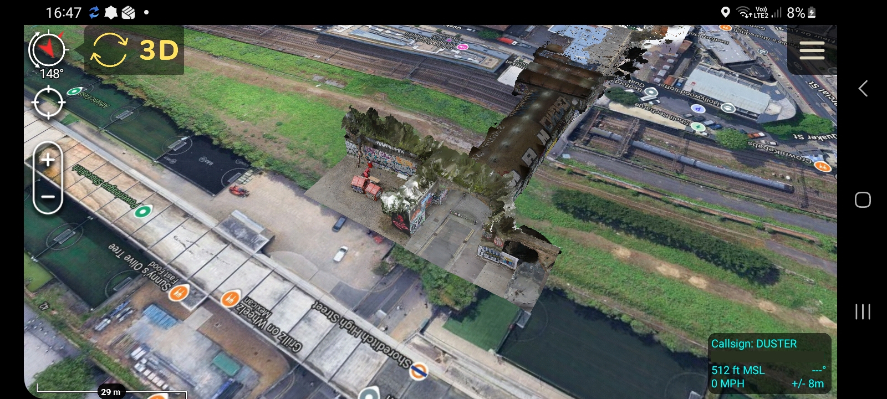
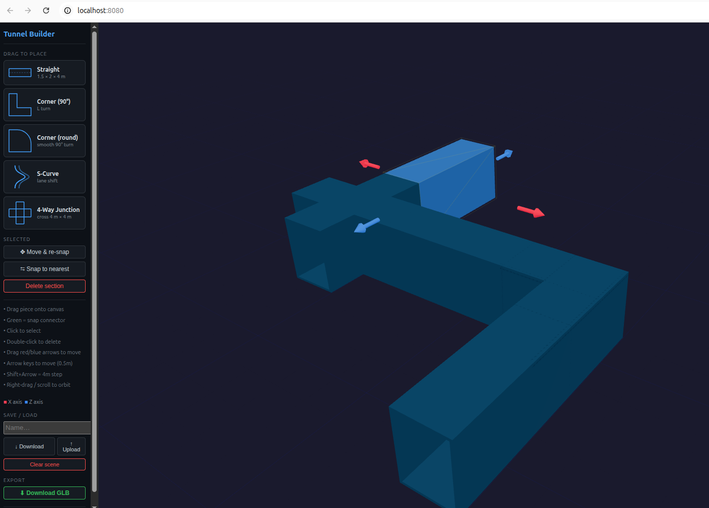

# 3D-tiles-blog
Helper scripts for working with GLB models and 3D Tiles. 

These were developed for the Tough Stump Rodeo 2026 to help process LiDAR data on edge compute. 

## LiDAR e57 to GLB

Transform a e57 Point Cloud scan into a binary glTF mesh (GLB)

## GLB to 3D Tiles

Transform a glTF mesh into a 3D Tile pyramid with geographic bounds

## Tunnel builder

Create a synthetic tunnel and export it to GLB. Useful if you need to model a tunnel in a hurry from limited information.

## Serving your 3D Tiles
Start a web server from the same folder where your 3D Tile are located. It should contain tileset.json

    python3 -m http.server 

## Adding 3D Tiles to ATAK

https://www.youtube.com/watch?v=MLw60rjI_1E

